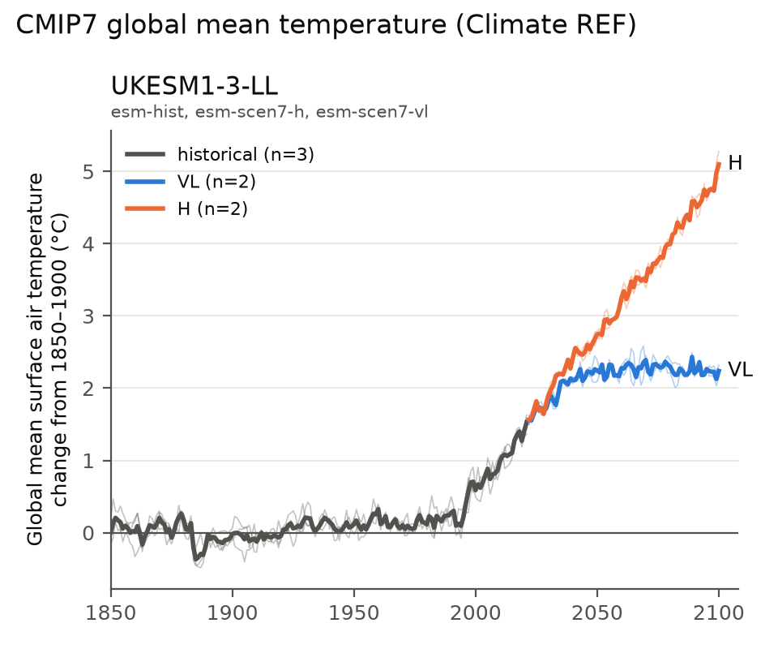

# cmip7ref

A small analysis toolkit for CMIP7 and CMIP6 output. It reads the diagnostic
results the [Climate REF](https://api.climate-ref.org/docs) has already computed,
and pulls raw fields from ESGF or the Pangeo mirror only where the REF has
nothing.



## Setup

```bash
uv sync
uv run pytest     # 32 tests, all offline
```

Nothing else is needed: every data source is public and unauthenticated. Two
cache directories are created on demand and are git-ignored — `.cache/ref-api/`
(REF responses, 6-hour TTL) and `.cache/esgf/` plus `.cache/obs/` (downloaded
files, kept indefinitely so a re-run costs nothing).

## Reproducing the figures

Each figure is one command, and each pull script prints its own coverage,
year-range and sanity checks. Times are from a home connection; the cost is
network, not CPU.

### ENSO: observed Niño3.4 against the CMIP6 ssp245 range

`figures/roni_context.png` and `figures/oni_context.png`

```bash
uv run scripts/pull_nino34.py     # ~2 h, 41 models; resumes if interrupted
uv run scripts/pull_obs_sst.py    # ~2 min, 160 MB of gridded ERSSTv6
uv run scripts/plot_nino34.py --index roni    # ENSO with mean-state warming removed
uv run scripts/plot_nino34.py --index oni     # Niño3.4 on a shared fixed baseline
```

`pull_nino34.py` reads monthly `tos` for every CMIP6 model with both
`historical` and `ssp245` (one member each, lowest realisation), and reduces it
to two box means — Niño3.4 and the 20°N–20°S belt — in a single pass per store.
It appends per model, so **an interrupted run resumes where it stopped**; pass
`--restart` to start over. The reads dominate: the stores chunk in time only, so
a small box still pulls the whole spatial field, which is why the year range
(`--years 1950 2060`) is what bounds the cost rather than the box size.

### CMIP7 carbon and energy products

`data/ukesm_*.csv`, consumed by figures made elsewhere

```bash
uv run scripts/pull_tas.py        # REF series, no download
uv run scripts/pull_co2.py        # near-surface CO2 -> ppm      (0.6 GB)
uv run scripts/pull_nbp.py        # land carbon flux -> PgC yr-1 (0.4 GB)
uv run scripts/pull_rtmt.py       # net TOA flux, drift-corrected (1.1 GB)
uv run scripts/pull_forcing.py    # prescribed CO2 and global emissions (1.3 GB)
uv run scripts/derive.py          # cumulative emissions, airborne fraction, sinks
uv run scripts/pull_cmip6_esm.py  # CMIP6 emissions-driven precedent, read lazily
```

About 3.4 GB in total, all cached. `derive.py` needs `pull_co2`, `pull_nbp` and
`pull_forcing` to have run first; the rest are independent.

### Exploratory plots, REF only (no downloads)

```bash
uv run scripts/inventory.py       # what CMIP7 tas data the REF holds and has processed
uv run scripts/plot_gmt.py        # historical + VL + H global-mean temperature
uv run scripts/plot_gmt.py --mip-era CMIP6 --scenarios ssp126 ssp585 --models MIROC6
uv run scripts/plot_cmip6_vs_cmip7.py
```

## How the data is obtained

Four sources, each used where it is the only one that works. The awkward details
behind that are in [docs/api_notes.md](docs/api_notes.md) and
[docs/data_availability.md](docs/data_availability.md).

| Source | Used for | Access |
|---|---|---|
| Climate REF API | global-mean `tas` for CMIP7 and CMIP6 | JSON, cached, no download |
| ESGF STAC (`api.stac.esgf.ceda.ac.uk`) | all CMIP7 model output | CQL2 search, HTTP download |
| Pangeo Zarr mirror (Google Cloud) | CMIP6 model output | lazy, over plain HTTPS |
| input4MIPs via ESGF Solr; NOAA CPC and PSL | forcing and observations | HTTP download |

Four things are worth knowing before you go looking for data yourself:

- **The REF serves global-mean `tas` and nothing else** for CMIP7. Its dataset records carry no file paths and no time ranges, so it indexes what exists but cannot deliver it.
- **CMIP7 model output is only in the ESGF STAC API**, not the legacy Solr index, and only over HTTP — there is no OPeNDAP. Filters must be CQL2; the simpler STAC `query` extension rejects `in`.
- **CMIP6 comes from the Pangeo mirror** because ESGF's advertised OPeNDAP endpoints return 404 at every node tried. Pangeo's coverage is narrower than ESGF's, and `pull_cmip6_esm.py` prints exactly what it found.
- **`co2mass` does not exist in CMIP7.** The branded near-surface `co2_tavg-h2m-hxy-u` stands in for it, and the CMIP6 comparison quantifies that proxy error where a model publishes both.

## Layout

| Path | Contents |
|---|---|
| `src/cmip7ref/client.py` | `RefClient`: REF API, pagination, disk cache |
| `src/cmip7ref/stac.py` | `StacClient`: ESGF STAC index, CQL2 search, resumable downloads |
| `src/cmip7ref/pangeo.py` | lazy CMIP6 access via the Pangeo Zarr mirror |
| `src/cmip7ref/reduce.py` | area- and calendar-weighted reduction to annual global series |
| `src/cmip7ref/forcing.py` | prescribed CO2 concentrations and global emissions |
| `src/cmip7ref/indices.py` | Niño3.4 / tropical box means, ONI and RONI anomalies |
| `src/cmip7ref/observations.py` | observed SST from gridded ERSST, and CPC's published indices |
| `src/cmip7ref/targets.py` | the approved CMIP7 pull list, members listed explicitly |
| `src/cmip7ref/timeseries.py` | REF series to DataFrame, stale-execution filtering, anomalies |
| `src/cmip7ref/experiments.py` | experiment families (`historical`/`esm-hist`, `scen7-*`, `ssp*`) |
| `src/cmip7ref/checks.py` | the coverage and sanity checks every script prints |
| `src/cmip7ref/plotting.py` | trajectory panels |
| `data/README.md` | **the CSV schema, exact source datasets, formulas and caveats** |
| `docs/api_notes.md` | REF API assessment and gotchas |
| `docs/data_availability.md` | what CMIP7 data exists, where, and at what size |

Outputs are tidy long CSVs under `data/`, one row per year (or month), with a
stable column order so figures made elsewhere can read them by raw GitHub URL.
**Column and file names are a contract** — add columns rather than renaming them.

## Method notes

- Concentration-driven and emissions-driven (`esm-`) runs are grouped into the same family. Panel subtitles show which experiment ids were used.
- Scenario members are matched to historical members on the **realisation index only** (`r<n>`), since the f-index differs between them, and `baseline_member` records which historical member was used.
- ENSO indices use a fixed 1991–2020 baseline for models and observations alike — also CPC's current operational base, so the observed values reproduce their published ONI and RONI. The RONI implementation matches CPC's to 0.035 °C.
- Reductions refuse cell-area weights whose grid does not fit the field, and series outside a physically plausible range are dropped and named rather than written. Both of these caught real problems; see `data/README.md`.
- Only one member per model is used in the CMIP6 ensembles, so the spread mixes model differences with internal variability.
